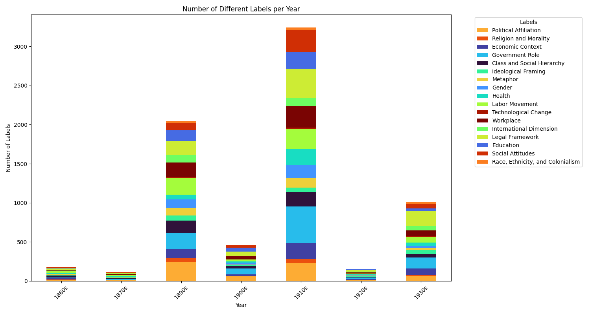
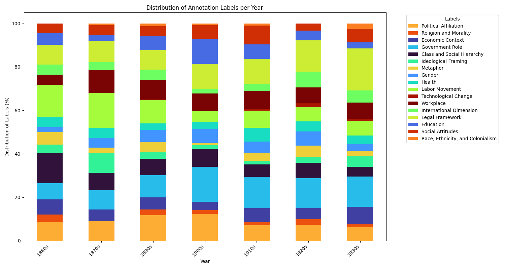
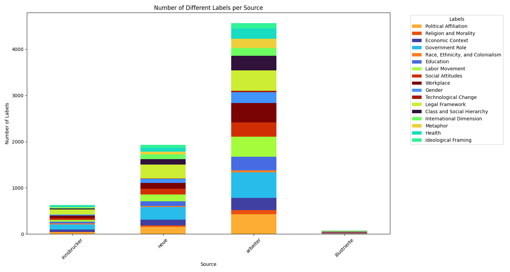
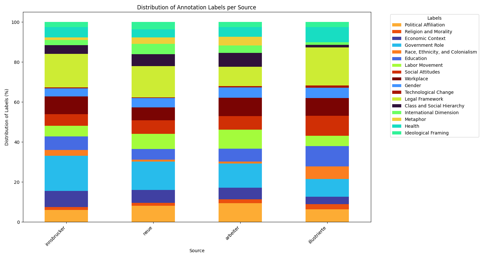
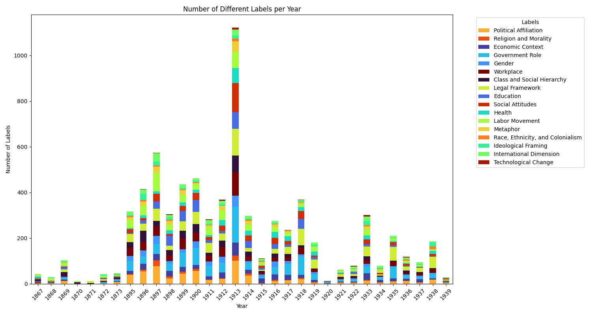
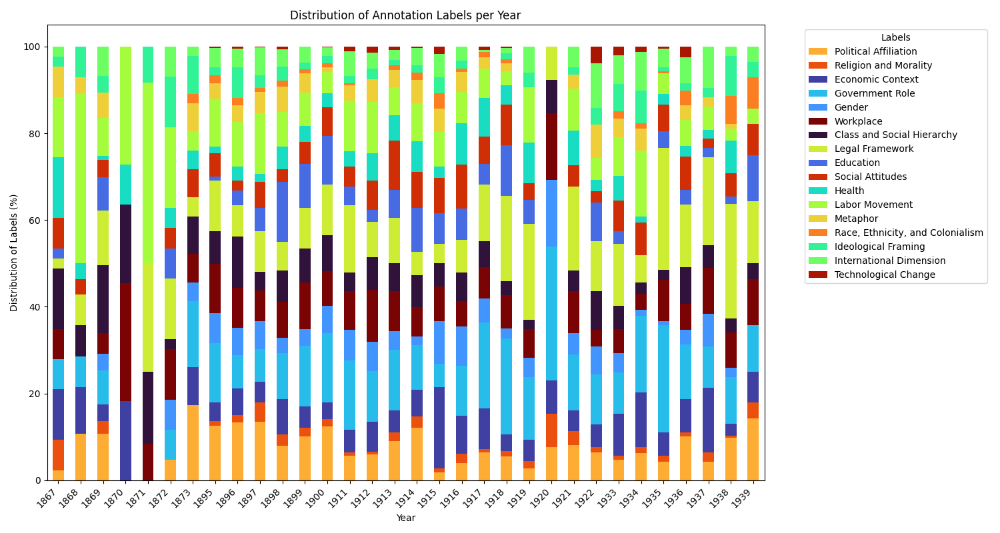

**German data Results**

In Austria, in the first half of the 19th century the demand for unskilled labor rose sharply due to the introduction of machines in commercial enterprises and emerging industries. Women, teenagers, and children worked as cheap labor on the machines. Factories grew larger, and with them the number of factory children. Their working day lasted eight to sixteen hours. Child labor increased the profitability of companies. Wages were very low. Only many children contributing to the family income enabled a working-class family to survive.

In 1842, a ban on child labor was introduced for the first time, and the Trade Regulation Act of 1859 also restricted the employment of young people (regulations were tightened in 1885, with a ban on night work for teenagers). The end of World War I in 1918 (among many social policy laws and regulations) also led to the law introducing the eight-hour working days in factories, the prohibition of night work for women and young people in commercial enterprises, and laws on child labor, minimum rest periods, and shop closing times. Exceptions for child labor (under 14 years of age) continued to be applied (apart from occasional services) in agriculture, where employment was permitted from the age of ten, and forestry, from the age of twelve, throughout the interwar period. After World War II, the Child and Youth Employment Act of 1948 regulated the protection of children and young people at work. The exceptions for agriculture and forestry were only slowly withdrawn from the 1960s onwards.

We see these developments reflected in the newspapers and in the German corpus used for the pilot-study. In the German corpus the decade when child labor issues show up mostly were the 1910s, where there is a strong correlation with “Government Role”, “Legal Framework”, “Social Attitudes”, as well as “Economic Context”, “Workplace”, “Health”, “Education” and “Gender” (see *Image 1*). This can be explained by the growing need for laws regulating labor especially in industry and larger enterprises prior to World War I. World War I which took place between 1914-1918 brought about many changes also in a socio-cultural context, with e.g., women’s suffrage being in place as of November 1918, child laber laws and eight-hour working day laws being issued over the following months.

*Image 1: Number of Different Labels per Year*

The data also reflects that throughout the entire period legal questions and the role of governments became more and more important while the issues associated with “Labor Movement” decreased over time (see *Image 2*). This can be explained with the increasing involvement of governments that regulated the work force and its economy through laws and regulations.

*Image 2: Distribution of Annotation Labels per Year*

Not surprisingly, when looking at the newspapers we selected for our corpus, the Arbeiterzeitung, which was the mouthpiece for the social democratic party and the labor movement talked about child labor in many different aspects, basically covering all the cathegories we tried to identify (see *Image 3*). Mostly there was a quite clear annotation with “Government Role” which indicates that the newspaper wanted more government involvement in dealing with child labor (or blamed the government for not doing enough). The Illustrierte Kronenzeitung, on the other hand, was not really interested in the issue.

*Image 3: Number of Different labels per Source*

How the different newspapers talked about the different issues and what topics this was connected with can be seen in the next image (*Image 4*):

*Image 4: Distribution of Annotation Labels per Source*

Splitting up the German data into yearly slices we can see, that child labor issues were most prominently present in the newspapers in 1913, the year before the beginning of World War I, in the years before the turn of the century (1895-1900) and in 1918 at the end of World War I (see *Image 5*). This is somewhat **surprising** considering the historical context: The most important child-labor laws were issued in 1859 and then again at the end of World War I. The **peak* in discussions about child labor prior the outbreak of World War I could **indicate** that this discourse was **interrupted** and at the same time **accelerated** by World War I so that at its end, society, economy and the government were ready to finalize the project of regulating labor in industries and larger enterprises. 

*Image 5: Number of Different Labels per Year*

In which categories child labor was mentioned by year can finally be seen in the last image (*Image 6*) created from the annotated data:

*Image 6: Distribution of Annotation Labels per Year*

**Overall comment**
Manually checking some of the data this output confirms that the annotation steps worked ok. There still a lot of over- or under-categorization and the main problems come from faulty OCR and missing layout detection and article segmentation respectively. **This means: the challenges of working with digital newspaper data remains high – with bottlenecks still being OCR and article segmentation – despite the advances that can be achieved with Few-Shot-Prompting.**

**Literature**
* Döller, Florentine, Der lange Kampf um geregelte Arbeitszeiten, in: *Kompetenz*, 19.04.2019, https://kompetenz-online.at/2019/04/10/der-lange-kampf-um-geregelte-arbeitszeiten/, (accessed 01.11.2025).
* Hawelka, Fritz/Österreichischer Kinderschutzkongress 2 1913 Salzburg, Die gesetzlichen Bestimmungen über die Kinderarbeit in Österreich, Ungarn, dem Deutschen Reiche, der Schweiz, England, Frankreich und Italien, Vienna 1913.
* Jankowski, Hellin, Kinderarbeit in Österreich: Verboten und doch gibt es sie noch, in: *Die Presse*, 10.07.2017, https://www.diepresse.com/5231602/kinderarbeit-in-oesterreich-verboten-und-doch-gibt-es-sie-noch, (accessed 01.11.2025).
* Kinderarbeit, in: Wien Geschichte Wiki, 17.10.2025, https://www.geschichtewiki.wien.gv.at/Kinderarbeit, (accessed 01.11.2025).
* Kulka, Lepoldine, Neues Frauenleben, no. 10 (1913).
* Österreich Arbeitsstatistisches Amt/ K.K. Arbeitsstatistisches Amt im Handelsministerium, Erhebung über die Kinderarbeit in Österreich im Jahre ..., Vienna 1910–1913.
* Papathanasiu, Maria, Zwischen Arbeit, Spiel und Schule: die ökonomische Funktion der Kinder ärmerer Schichten in Österreich 1880–1939. PhD-Thesis, University of Vienna 1999.
* Papathanassiou, Maria, Approaches to the History of Child Labour in Europe, in: *Jahrbuch Für Wirtschaftsgeschichte*, vol. 48, no. 2, 2007, pp. 231–42, https://doi.org/10.1524/jbwg.2007.48.2.231, (accessed 01.11.2025).
* Schmitt, Stefanie Maria, Determinants of Child-Labor in Austria in 1908, MA-Thesis, University of Innsbruck 2018.
* Žižek, Franz/Österreichischer Kinderschutzkongress 2 1913 Salzburg, Verbreitung und Erscheinungsformen der Kinderarbeit in Österreich, Vienna 1913.
